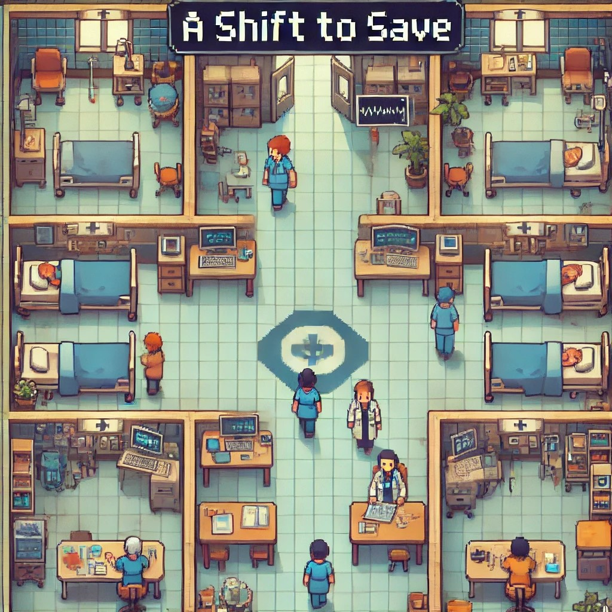

# Last Haven

  

### Description
*Last Haven* is a survival game set in a post-apocalyptic world overrun by zombies. Players take on the role of a leader within a fortified prison, transforming it into the last safe haven for humanity. Defend the prison from waves of zombies, repair the perimeter, and fend off human raiders while managing vital resources like food, water, and medicine. Scavenge for supplies, fortify defenses, and protect your group at all costs. The longer you survive, the harder the challenges become. How long can you keep the prison standing?

### Key Features

- **Audience:** Recommended for ages 10+  
- **Game Modes:** Single-player with cooperative missions available  
- **Goals:** Survive as long as possible, protect the prison, manage resources, and fend off zombie hordes  
- **Gameplay:** Defend the prison walls, perform supply runs, fight zombies, and manage resources to sustain the camp  
- **End Goal:** Survive as long as possible, preventing the prison from being overrun  
- **Creators:** Koren Abdush, Amit Gini  
- **More Information:** [Game Documentation](https://github.com/GiniProj/Last-Haven/blob/main/formal-elements.md)  

### Game Components

- **Resource Management:** Balance food, water, and medicine while defending the prison.
- **Combat System:** Fight off zombies with various weapons, using strategy to survive.
- **Supply Runs:** Scavenge for supplies outside the prison to maintain resources.
- **Defense System:** Fortify the prison and repair fences to prevent zombies from breaking in.
- **Dynamic Difficulty:** The game gets progressively harder, with more zombies and greater challenges.
- **Co-op Missions:** Team up with others in cooperative missions to survive together.

Can you defend your last haven in a world overrun by the undead? Find out in *Last Haven!*
